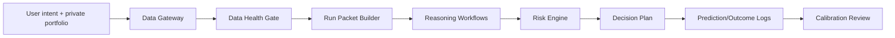

# A-Share AI Research & Trading Decision Assistant

一个面向 A 股短线/波段交易者的 AI 决策支持系统。它把“看新闻、看盘口、看板块、看仓位、写交易计划”收敛成可审计的 Agent 工作流：先做数据权限判断，再做市场状态分类、个股证据栈、概率/期望 R 计算和风控约束。

> 本项目只做研究、计划和风险提示，不自动下单，不承诺收益，不构成投资建议。

## 项目入口

- 产品案例：[Product Case Study](docs/portfolio.md)
- Agent 架构：[Investment Decision-Support Agent Architecture](docs/agent_architecture.md)
- 互动 Demo：[投资辅助 Agent 工作台 Demo](docs/demo/index.html)
- 工作流说明：[Runbook](docs/runbook.md)
- 数据与证据边界：[Data Source Requirements](docs/data_sources.md)
- 预测与评估体系：[Prediction Automation System](docs/prediction_automation_system.md)
- 评测集与失败案例：[Evaluation Cases And Iteration Notes](docs/evaluation_cases.md)
- 公开验证报告：[Public Validation Report](docs/validation_report.md)
- 历史阈值校准：[Historical Threshold Calibration](docs/historical_threshold_calibration.md)
- 产品决策记录：[Product Decision Record](docs/product_decision_record.md)
- Prompt 样例：[09:28 竞价](prompts/auction_check.md)、[14:30 尾盘](prompts/tail_check.md)、[主题筛选](prompts/theme_screening.md)、[单股深研](prompts/single_stock_research.md)

## 真实市场需求

A 股交易者每天面对三个高频痛点：

1. 信息过载：公告、题材、盘口、板块和持仓风险同时变化，容易只看单一信号。
2. 决策不可复盘：判断写成“看好/不看好”，缺少概率、触发条件和失败条件。
3. 风控滞后：先买入，后找理由；亏损后容易用沉没成本替代重新评估。

本项目的产品目标不是“预测涨跌”，而是把 AI 输出限制在可验证、可复盘、可执行的决策框架内：数据不足就降级，市场状态不允许就不新增风险，任何买入/加仓都必须有 1R、结构止损、目标 R、仓位上限和不交易条件。

## 核心能力

| 能力 | 对应文件 | 展示点 |
| --- | --- | --- |
| 交易场景识别 | `docs/prediction_automation_system.md` | 强进攻、轮动、退潮、冰点修复、混沌五类状态 |
| 风控发动机 | `config/portfolio.example.json`、`tools/trading_assistant.py` | 从止损距离倒推仓位，避免用主观信心定仓 |
| 数据权限门 | `docs/data_sources.md` | A0/A1/A2/B1/B2/B3/C 分层，数据不足时自动降级 |
| 消息面 RAG 设计 | `docs/evaluation_cases.md` | 交易所/公司公告、主流证券报新闻和行情终端数据的混合检索、引用一致性和过期拦截 |
| Agent Prompt | `prompts/*.md` | 09:28、14:30、主题筛选、单股深研四类任务 |
| 本地运行包 | `tools/trading_assistant.py render ...` | 自动组装上下文、配置校验、缺失数据和执行提示词 |
| 预测复盘 | `prediction template/summary` | 事件概率、期望 R、结果日志与校准闭环 |
| Agent 架构 | `docs/agent_architecture.md` | 用最小必要模块串起数据、推理、风控和复盘 |
| 可审计产物 | `examples/workflow_trace.sample.json`、`examples/run_packet.sample.md` | 证明数据包、运行包、预测日志和复盘日志如何串起来 |
| 公开验证集 | `tools/portfolio_validation.py`、`docs/validation_report.md` | 30 条离线 guardrail 用例，覆盖数据缺失、RAG、风控、用户误用和计划完整性 |
| 历史阈值校准 | `tools/historical_threshold_calibration.py`、`docs/historical_threshold_calibration.md` | 过去一个月 20 个交易日、100 个 09:28 观察、100 个 14:30 观察，校准 A1/B1/A2 降级规则 |

## 快速体验

```bash
python3 -m venv .venv
source .venv/bin/activate
pip install -r requirements.txt

python3 tools/trading_assistant.py validate
python3 tools/trading_assistant.py render auction --date 2026-05-22 --stdout
python3 tools/trading_assistant.py data-health --date 2026-05-22 --time 0928 --automation auction
python3 tools/trading_assistant.py prediction template --date 2026-05-22 --automation auction
python3 tools/portfolio_validation.py --format markdown
python3 tools/historical_threshold_calibration.py --start-date 2026-04-27 --end-date 2026-05-27
```

如果没有本地私有配置，工具会自动读取 `config/portfolio.example.json`。真实使用时复制一份私有配置：

```bash
cp config/portfolio.example.json config/portfolio.json
```

`config/portfolio.json`、`docs/trading_assistant_state.md`、`data/manual/` 和 `reports/` 默认被 Git 忽略，避免公开账户、持仓和历史报告。

## 工作流



## 设计原则

1. 事实、推断、计划分离：价格、公告、资金代理和交易动作不混写。
2. 数据不足自动降级：关键数据缺失时只输出低权限清单，不做高置信结论。
3. 反沉没成本：持仓不因已经亏损、已经研究或已有仓位而获得继续持有特权。
4. 概率化表达：每个可执行计划必须包含成功/失败/噪音概率和期望 R。
5. 人在回路：系统不下单，只输出研究包、风控边界和复盘记录。

## 目录结构

```text
.
├── config/portfolio.example.json      # 脱敏样例组合
├── docs/
│   ├── portfolio.md                   # 产品案例说明
│   ├── agent_architecture.md          # 投资辅助决策 Agent 架构
│   ├── demo/index.html                # 可互动 Demo
│   ├── data_sources.md                # 数据分层与证据要求
│   ├── evaluation_cases.md            # 评测集、失败案例与消息面 RAG 方案
│   ├── prediction_automation_system.md
│   └── runbook.md
├── prompts/                           # Agent 工作流 Prompt
├── tests/                             # 本地校验
└── tools/trading_assistant.py          # 本地运行器
```

## 验证

```bash
python3 -m unittest discover -s tests
python3 tools/portfolio_validation.py --format markdown
```

当前公开验证集包含 30 条离线 guardrail 用例，验证数据权限、RAG 证据边界、风控完整性、用户误用拦截和计划可审计性。该验证不声称投资收益，只证明产品约束可以被重复检查。

历史阈值校准见 `docs/historical_threshold_calibration.md`：过去一个月公开数据支持保留 A1 80% 覆盖阈值和 B1 市场结构要求；公开历史源无法提供 A2 竞价明细，因此缺 A2 时仍只能输出 09:30-09:45 确认条件，禁止追强。

## 风险声明

本项目不提供确定性预测，不保证收益，不替代专业投资顾问。公开仓库中的组合、价格、概率和输出均为样例，用于展示 AI 产品设计、工作流编排、风控约束和可复盘机制。
