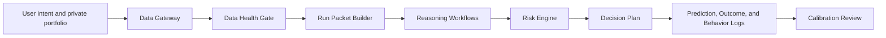

# Investment Decision-Support Agent Architecture

This document defines the project as an investment decision-support agent, not a trading bot. The agent's job is to collect evidence, constrain reasoning, produce auditable plans, and improve calibration over time. It never places orders or presents profit as guaranteed.

## 1. Design Goals

| Goal | Requirement | Implementation |
| --- | --- | --- |
| Clear architecture | Every module has a single role and explicit input/output | Data gateway, health gate, context packet, reasoning workflows, risk engine, audit logs |
| Low complexity | Keep the core runnable locally with minimal dependencies | Python CLI + JSON config + Markdown prompts + static demo |
| Evidence-based reasoning | No conclusion can outrun the available data | A0/A1/A2/B1/B2/B3/C data layers and output permission rules |
| Operational discipline | Every plan must define trigger, stop, target, invalidation, and do-not-trade condition | Prompt contracts and risk engine checks |
| Decision-quality improvement | Improve decision quality through review and calibration | Prediction JSONL, outcome JSONL, behavior-risk JSONL, error types, weekly review |

## 2. Minimal Architecture

### Module Responsibilities

| Module | Responsibility | Input | Output |
| --- | --- | --- | --- |
| Data Gateway | Collect market, minute, MA, breadth, and optional proxy data | Codes, date, time, enabled layers | CSV/JSON data package |
| Data Health Gate | Decide what the system is allowed to conclude | Data coverage, available layers | Grade A/B/C/D and restrictions |
| Run Packet Builder | Assemble all context needed for a run | Config, watchlist, risk rules, data gaps, prompt | Auditable Markdown run packet |
| Reasoning Workflows | Structure market, sector, and stock judgment | Run packet + prompt contract | Facts, inferences, candidate plans |
| Risk Engine | Convert stops and regime caps into position limits | Account, stop distance, regime, loss limits | Max size, risk in R, invalidation |
| Decision Plan | Produce human-readable action plan | Evidence + risk engine | Buy/hold/reduce/observe plan, or no-trade condition |
| Audit Logs | Preserve machine-readable predictions, results, and behavior-risk events | Event probabilities, actual outcomes, user overrides | JSONL prediction/outcome/behavior rows |
| Calibration Review | Find systematic mistakes | Logs, behavior metrics, and error types | Weight adjustments and next-run guardrails |
| Guardrail Validation | Regression-test data, RAG, risk, misuse, and plan-quality controls | Public validation cases | 30-case offline validation report |

## 3. Data Layers And Permissions

| Layer | Content | Role |
| --- | --- | --- |
| A0 | Account, holdings, cash, cost, risk budget | Required for any sizing |
| A1 | Quote, open/high/low, turnover, VWAP, minute data, MA | Required for stock-level evidence |
| A2 | Call auction, seal amount, queue/cancel signal, manual screenshot import | Required for high-confidence opening conclusions |
| B1 | Market breadth, limit-up/down, sector structure, sentiment | Required for market regime |
| B2/B3 | Chips, fund-flow proxy, Dragon-Tiger, margin, holder data | Probability modifiers only |
| C | News, announcements, IR, earnings driver data | Catalyst and thesis update |

The rule is simple: missing data lowers output permission automatically. The model must not fill gaps with invented facts.

## 4. Core Workflow

1. Validate private or sample portfolio config.
2. Collect or import the required data package.
3. Run `data-health` to assign output permission.
4. Build a run packet with context, data gaps, risk rules, and prompt contract.
5. Produce the research plan using fixed analysis order:
   market regime, macro, sector, stock evidence, resonance, stage, operation, risk.
6. Write prediction rows for every event that needs calibration.
7. Record outcome rows after the event window closes.
8. Record behavior-risk rows when a user attempts plan-outside, no-stop, or guardrail-violating actions.
9. Review mistakes by error type: scenario error, base-rate error, factor overweight, data missing, unclear execution, or user override.

## 5. Cost And Complexity Control

Keep in core:

1. Local Python CLI.
2. JSON portfolio config and sample config.
3. Markdown prompt contracts.
4. Static web demo.
5. Unit tests and CI.

Keep optional:

1. AKShare market activity and fund-flow proxy collectors.
2. Tonghuashun screenshots/manual auction import.
3. Holder/chip/Dragon-Tiger optional layers.
4. Web console beyond the static demo.

Avoid:

1. Broker trading API integration.
2. Unstable scraping as a mandatory dependency.
3. Large vector databases before there is a clear retrieval need.
4. Multi-agent complexity before the single-run audit chain is stable.

## 6. Investment Philosophy Encoded

The system follows a decision-quality philosophy rather than a prediction-certainty philosophy:

1. Risk first: define 1R and stop condition before position size.
2. Regime first: market state determines whether new risk is allowed.
3. Evidence stack: a stock conclusion requires tape, K-line, MA, liquidity, sector role, catalyst quality, and risk-reward.
4. Bayesian update: prior thesis has no privilege after new evidence.
5. Anti-sunk-cost: existing holdings must re-earn their place.
6. Human final decision: the agent recommends plans and constraints, not orders.

This does not guarantee stable profit. It creates a process where risk, evidence, and calibration can be reviewed, corrected, and improved over time.

## 7. Validation Boundary

The public repository includes `tools/portfolio_validation.py`, a 30-case
offline guardrail validation set. It checks whether the product rules handle
data gaps, RAG source conflicts, missing stops, deterministic-return requests,
auto-trade requests, and plan-quality gaps.

This validation is intentionally scoped:

1. It validates guardrails and output permissions.
2. It does not validate live investment returns.
3. It does not claim production-grade realtime RAG latency.
4. It creates a reproducible baseline before historical replay validation.

## 8. What Makes The Agent Useful

| Value | How It Shows Up |
| --- | --- |
| Fewer hallucinations | Data health gate blocks unsupported claims |
| Better execution discipline | Plans require trigger, stop, target, invalidation, and no-trade condition |
| Lower review cost | Run packets collect context in one file |
| Measurable learning | Prediction, outcome, and behavior logs convert narrative judgment and user-risk behavior into data |
| Safer public sharing | Private config and reports are ignored by Git; sample config demonstrates the workflow |
