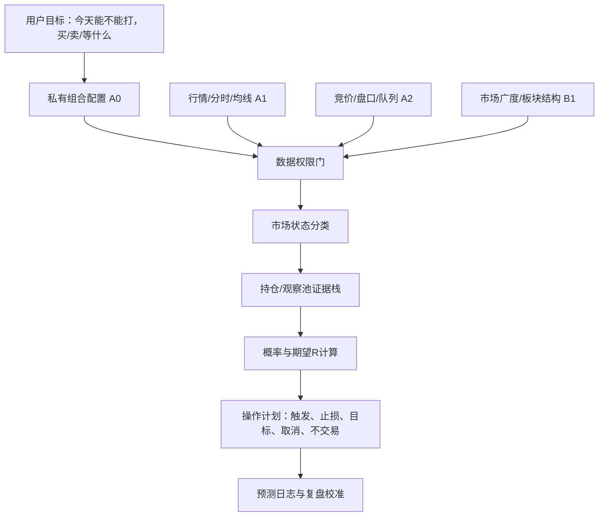

# Product Case Study｜A 股研究与交易决策支持 Agent

## 1. 一句话定位

面向高频信息环境下的 A 股个人交易者，构建一个“可审计、可降级、可复盘”的 AI 决策支持 Agent：它不替用户下单，而是把市场状态、持仓风险、主题结构、单股证据和交易计划组织成概率化输出。

## 2. 为什么这是一个真实需求

目标用户不是缺信息，而是缺“把信息变成可执行判断”的稳定流程。

| 用户痛点 | 典型表现 | 产品解法 |
| --- | --- | --- |
| 信息过载 | 盘口、新闻、公告、板块和持仓同时变化 | 数据分层：A0/A1/A2/B1/B2/B3/C |
| AI 幻觉风险 | 模型容易编造价格、资金流或确定性判断 | 缺数据就降级；明确禁止编造行情和来源 |
| 决策冲动 | 因为亏损、已研究或怕错过继续加仓 | 贝叶斯更新 + 沉没成本控制 |
| 计划不可复盘 | 只有“看好/不看好”，没有成败判据 | 事件概率、期望 R、预测日志和结果日志 |
| 风控滞后 | 先买后想止损，仓位靠信心 | 先定义结构止损和 1R，再倒推仓位 |

这个项目没有把 AI 包装成“荐股工具”。更准确的定位是交易前决策质量控制系统：它让用户在下注前暴露证据缺口、风险预算和失效条件。

## 3. 设计标准

| 标准 | 常见问题 | 本项目对应能力 |
| --- | --- | --- |
| 真实业务场景 | 只有 Prompt 展示，没有真实用户问题 | 围绕 A 股盘前/盘中决策，时间窗口明确 |
| Agent 工作流 | 只有聊天问答，没有任务状态 | 09:28 竞价、14:30 尾盘、主题筛选、单股深研 |
| 工具调用与数据边界 | 模型自由发挥，无法追溯 | 本地 runner 生成 run packet，数据缺失显式化 |
| 评估闭环 | 没有指标、没有复盘 | 预测 JSONL、outcome JSONL、期望 R 与校准 |
| 安全合规 | 暗示确定收益或代客交易 | 明确不自动下单、不承诺收益、人在回路 |
| 可交付性 | 只有想法，没有可运行资产 | CLI、单元测试、互动 Demo、脱敏样例配置 |

## 4. 产品架构



## 5. 核心工作流

### 09:28 竞价预测与开盘计划

目标：回答“今天能不能打、什么结构有下注资格、开盘后如何确认和撤销”。

关键约束：

1. 关键竞价数据不足时，输出降级为开盘确认清单。
2. 必须给市场状态、仓位权限、持仓事件概率、开盘执行表。
3. 买入/加仓必须满足数据权限、正期望 R 和结构止损。

### 14:30 尾盘预测与隔夜计划

目标：回答“09:28 判断哪里对/错、今天强度是否有隔夜价值、明天 09:28 验证什么”。

关键约束：

1. 先复盘早盘预测，再判断尾盘隔夜风险。
2. 尾盘买入必须扣除隔夜跳空风险。
3. 任何隔夜计划都要给次日竞价验证条件。

### 主题筛选与单股深研

目标：把“概念标签”升级为“板块角色 + 催化质量 + 资金反馈 + 风险收益”。

关键约束：

1. 每个方向至少区分龙头、中军、补涨、观察票和明确排除票。
2. 单股结论必须覆盖实时盘口、K 线/均线、成交、流动性、资金代理、板块角色、催化质量和风险收益。
3. 不能因为股票涨得多就直接判定为龙头。

## 6. 产品能力拆解

| 能力维度 | 项目证据 |
| --- | --- |
| 用户洞察 | 把交易者痛点拆成信息过载、冲动交易、不可复盘、风控滞后 |
| 业务抽象 | 五类市场状态、三层共振、阶段库、交易模式库 |
| Agent 设计 | 多工作流 Prompt、上下文包、数据权限门、输出降级 |
| 数据产品意识 | 覆盖率、数据等级、缺失字段对结论权限的影响 |
| 风控与合规 | 人在回路、无自动下单、无收益承诺、敏感配置不入库 |
| 工程协作 | Python CLI、unittest、GitHub Actions、静态互动 Demo |
| 评估意识 | 事件概率、expected R、预测日志、结果日志、误差类型 |

## 7. Demo 使用方式

1. 打开 [互动 Demo](demo/index.html)。
2. 选择 `tail-data`、`stock-data` 或 `data-health` 接口模式。
3. 输入日期、时间、股票代码和数据层，查看本地 runner 命令、预期输出文件和覆盖率结构。

这个 Demo 不展示交易动作，只展示数据接入契约：系统先把行情、分时、均线、竞价手工导入和市场广度组织成可审计的数据包，再交给后续研究工作流使用。

## 8. 输入与输出示意

输入示意：

```json
{
  "mode": "tail-data",
  "date": "2026-05-22",
  "time": "1430",
  "codes": ["002156.SZ", "600584.SH", "600601.SH"],
  "enabled_layers": ["A1", "A2", "B1"]
}
```

输出示意：

```json
{
  "command": "python3 tools/trading_assistant.py collect tail-data --date 2026-05-22 --time 1430 --codes 002156.SZ 600584.SH 600601.SH",
  "expected_outputs": [
    "reports/2026-05-22-1430-tail-data.csv",
    "reports/2026-05-22-1430-tail-data.json"
  ],
  "coverage_probe": {
    "quote": 0.92,
    "minute": 0.88,
    "daily": 0.94,
    "core": 0.88
  }
}
```

## 9. 成功指标

| 指标 | 定义 |
| --- | --- |
| 数据覆盖率 | A1/A2/B1 覆盖是否达到输出权限要求 |
| 可执行计划率 | 输出中包含触发、止损、目标、不交易条件的比例 |
| 幻觉拦截率 | 缺失行情/公告/资金数据时是否拒绝高置信结论 |
| 预测校准 | 成功概率分桶后的实际命中率与 Brier score |
| 风险纪律 | 计划内止损执行、连续止损暂停、非计划交易次数 |

该项目的核心不是“用 AI 炒股”，而是把高风险决策场景产品化：用 Agent 做证据组织和决策约束，用概率日志做持续校准。

## 10. 下一阶段路线图

1. 接入更稳定的实时行情和交易日历，降低手工截图依赖。
2. 增加预测结果自动归因：场景误判、基准概率错误、正/负因子权重错误、数据缺失。
3. 增加用户行为日志：是否按计划执行、是否出现计划外交易。
4. 做多账户/多策略隔离：短线、波段、配置型策略分别建模。
5. 将静态 Demo 升级为可录屏演示的 Web 控制台。
